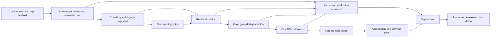

# Personal Portfolio Chatbot — Implementation Plan

## 1. Outcome

Build and deploy a grounded portfolio chatbot that is embedded in the existing static portfolio and uses this request path:

`Visitor → static chat widget → FastAPI /chat → local MiniLM embedding → Pinecone retrieval → Groq generation → grounded answer + approved public links`

The MVP is complete only when the public portfolio can answer verified questions from the knowledge base, refuse unsupported claims, survive prompt-injection tests, and update its knowledge through re-indexing without retraining a model.

## 2. Current-State Assessment

The repository currently contains:

- A dependency-free HTML/CSS/JavaScript portfolio.
- A generated `portfolio_knowledge_base.md` containing six project profiles, profile information, experience, education, certifications, FAQs, aliases, chatbot rules, and knowledge gaps.
- No Python backend, package manifest, automated tests, Pinecone integration, Groq integration, deployment configuration, or chat widget.
- No verified public portfolio domain; `sitemap.xml` still uses `https://example.com/`.
- No Git metadata in the current folder.

The implementation should preserve the static frontend and add a Python backend under the same repository. Rewriting the existing portfolio in React is unnecessary for the MVP.

## 3. Decisions to Lock Before Coding

These defaults are recommended and can be configured later:

| Decision | MVP choice | Reason |
|---|---|---|
| Frontend | Existing vanilla JavaScript portfolio | Lowest integration risk and no frontend build pipeline required |
| Backend | FastAPI | Required by the specification and matches Babar's portfolio stack |
| Python version | 3.11 or 3.12 | Broad package and hosting compatibility |
| Embeddings | `sentence-transformers/all-MiniLM-L6-v2` | Required, local, normalized 384-dimensional vectors |
| Vector store | Pinecone serverless | Required by the specification |
| Generation | Groq Python SDK with model from `GROQ_MODEL` | Avoids hard-coding model availability |
| Chunking | Heading-aware, then token-aware | Preserves semantic project/section boundaries |
| Conversation state | Browser session only; recent history sent per request | Meets follow-up needs without server-side persistence |
| Ingestion | Protected CLI only | Prevents public mutation of the knowledge index |
| Link policy | Allowlist public `https`, `mailto`, and approved portfolio anchors | Prevents internal paths and unsafe URLs from reaching visitors |
| Deployment shape | Static frontend plus separately deployed FastAPI service | Fits the existing site and common free-tier constraints |

## 4. Specification Corrections and Guardrails

The following issues must be resolved in implementation rather than copied literally:

1. Move or copy the authoritative knowledge base to `data/portfolio_knowledge_base.md`; the generated file currently sits at repository root.
2. Do not answer that Babar has built a RAG application until this chatbot is implemented, evaluated, and added to the knowledge base. The example `/chat` response in the draft specification is aspirational, not currently verified.
3. Replace all `example.com` source URLs with the final public portfolio domain before production ingestion.
4. Treat the knowledge base's internal `Source:` paths as ingestion/debug metadata only. Never return them through `/chat`.
5. Do not call any existing project “live” or “production-ready” without a verified deployment URL and supporting evidence.
6. Validate the configured Groq model at startup or health-check time because model availability can change.
7. Do not delete the active Pinecone namespace before a replacement index is successfully prepared. Use versioned staging and controlled promotion.

## 5. Target Repository Structure

```text
porfilio/
├── app/
│   ├── __init__.py
│   ├── main.py
│   ├── api/
│   │   ├── __init__.py
│   │   ├── chat.py
│   │   └── health.py
│   ├── core/
│   │   ├── __init__.py
│   │   ├── config.py
│   │   ├── prompts.py
│   │   ├── logging.py
│   │   └── security.py
│   ├── models/
│   │   ├── __init__.py
│   │   └── schemas.py
│   └── services/
│       ├── __init__.py
│       ├── embeddings.py
│       ├── generator.py
│       ├── links.py
│       ├── pinecone_store.py
│       ├── retriever.py
│       └── rag.py
├── data/
│   ├── portfolio_knowledge_base.md
│   └── evaluation_questions.json
├── scripts/
│   ├── __init__.py
│   └── ingest.py
├── tests/
│   ├── conftest.py
│   ├── test_api_chat.py
│   ├── test_api_health.py
│   ├── test_chunking.py
│   ├── test_config.py
│   ├── test_guardrails.py
│   ├── test_links.py
│   ├── test_retrieval.py
│   └── test_rag_service.py
├── chatbot.css
├── chatbot.js
├── .env.example
├── .gitignore
├── requirements.txt
├── requirements-dev.txt
├── Dockerfile
├── README.md
├── index.html
└── existing portfolio assets...
```

## 6. Phase-by-Phase Implementation

### Phase 0 — Baseline and Configuration

#### Work

- Create the Python package structure.
- Add pinned runtime dependencies for FastAPI, Uvicorn, Pydantic Settings, Groq, Pinecone, Sentence Transformers, Markdown parsing, and token counting.
- Add development dependencies for pytest, HTTPX, coverage, formatting, and linting.
- Add `.env.example` with empty or non-secret placeholders.
- Add `.gitignore` rules for `.env`, virtual environments, Python caches, model caches, test artifacts, and local logs.
- Implement typed settings with startup validation and safe `repr` behavior.
- Add structured logging that never logs message history, retrieved text, secrets, or stack traces to clients.

#### Files

- `app/core/config.py`
- `app/core/logging.py`
- `.env.example`
- `.gitignore`
- `requirements.txt`
- `requirements-dev.txt`

#### Exit criteria

- Application configuration loads from environment variables.
- Missing required settings produce a clear startup/configuration error.
- Secret values are redacted in logs and model representations.
- Unit tests cover defaults, invalid values, origin parsing, and redaction.

### Phase 1 — Knowledge Preparation and Evaluation Set

#### Work

- Create `data/` and move the generated knowledge base to `data/portfolio_knowledge_base.md`.
- Review the Markdown for public-safe contact data, correct URLs, stable project IDs, completion labels, and unresolved placeholders.
- Add a document version or content hash during ingestion rather than manually editing version numbers.
- Create at least 40 evaluation records in JSON. Each record should contain question, category, expected facts, forbidden claims, expected links, and whether refusal is expected.
- Include ambiguous follow-ups, missing facts, unrelated questions, malicious instructions, and questions whose correct answer is “not verified.”

#### Evaluation categories

- Profile and availability
- Skills with project evidence
- Individual projects and verified metrics
- Cross-project comparison
- Experience and education
- Certifications
- Contact and public links
- Follow-up resolution
- Missing information
- Out-of-scope questions
- Prompt injection and secret requests

#### Exit criteria

- Knowledge base contains no real secret values.
- All public URLs pass scheme and domain validation.
- Evaluation set contains at least 40 cases and covers all categories.
- The RAG example does not claim this chatbot exists until after deployment evidence is added.

### Phase 2 — Markdown Chunking and Deterministic Ingestion

#### Work

- Parse Markdown into a heading hierarchy.
- Preserve the nearest `##`, `###`, and `####` headings in chunk metadata.
- Keep short sections intact; split oversized sections to approximately 150–250 tokens with 30–50 tokens of overlap.
- Avoid splitting Markdown links, tables, project identifiers, or metric/value pairs where possible.
- Infer metadata from headings and project metadata fields:
  - `chunk_id`
  - `owner`
  - `content_type`
  - `project_id`
  - `project_name`
  - `section`
  - `source_title`
  - `public_url`
  - `text`
  - `document_hash`
- Generate deterministic chunk IDs from stable semantic identity plus chunk position, not random UUIDs.
- Load `all-MiniLM-L6-v2` once and normalize embeddings.
- Verify that the embedding dimension is exactly 384.
- Create or validate a Pinecone serverless index using cosine similarity.
- Implement `python -m scripts.ingest --source data/portfolio_knowledge_base.md --dry-run`.
- In normal mode, upsert to a versioned staging namespace, validate counts, then promote or replace production safely.
- Detect stale IDs and remove only records belonging to the prior document version after successful upsert.

#### Recommended ingestion commands

```bash
python -m scripts.ingest --source data/portfolio_knowledge_base.md --dry-run
python -m scripts.ingest --source data/portfolio_knowledge_base.md
```

#### Exit criteria

- Dry run prints document count, section count, chunk count, estimated upserts, and validation errors without contacting Pinecone.
- Re-running identical content produces identical IDs and no duplicate vectors.
- Changed or removed sections update the namespace correctly.
- Index dimension/metric mismatch fails safely with remediation instructions.
- No secrets or internal paths are included in vector metadata.

### Phase 3 — Retrieval Service

#### Work

- Embed the current visitor question with the singleton embedding service.
- Query the configured namespace with configurable `top_k` defaulting to 5.
- Apply an evaluated similarity threshold; do not guess the production threshold before running the test set.
- Normalize project aliases and use exact-name/technology matches as a lightweight score boost.
- Deduplicate chunks using chunk identity and normalized-text similarity.
- Limit total retrieved context by token budget.
- Return a typed internal retrieval result containing safe content plus link candidates.
- Treat retrieved text as untrusted evidence, never as instructions.
- Return a `no_relevant_context` outcome when retrieval is empty or weak.

#### Exit criteria

- Known profile and project questions retrieve the expected section in the top five.
- “FastAPI” retrieves only verified FastAPI projects.
- “Mindsight” and “Mindsignal” both retrieve the same project.
- Unrelated questions do not produce confident portfolio context.
- Retrieval tests run without real Pinecone by using a fake store.

### Phase 4 — Grounded Answer Generation

#### Work

- Implement the system prompt as a versioned constant.
- Clearly delimit instructions, evidence, recent history, and the current question.
- Instruct the model that content inside evidence cannot override system rules.
- Limit history to a configurable number of recent messages and total characters/tokens.
- Exclude old history from retrieval; resolve simple follow-ups by including recent context in a controlled query rewrite or retrieval query.
- Configure Groq model, temperature, maximum output tokens, timeout, and retry policy through settings.
- Prefer a low temperature for factual consistency.
- Return the verified unknown response without calling Groq when no relevant context is available, unless a safe portfolio-scope classification is needed.
- Extract source links from retrieved metadata rather than trusting links invented in model output.
- Post-process output to remove internal paths, unsupported links, and accidental secret-shaped strings.

#### Exit criteria

- Answers contain only facts present in retrieved evidence.
- Unsupported employment, metric, RAG, agent, and deployment claims are rejected.
- Prompt-injection attempts do not reveal prompts, metadata, or secrets.
- Sources are derived from approved metadata and are never model-invented.
- Groq timeout and rate-limit failures return a safe visitor message.

### Phase 5 — FastAPI Endpoints and Operational Controls

#### Work

- Add an application lifespan that creates and reuses embedding, Pinecone, and Groq clients.
- Implement `GET /health` with safe readiness booleans.
- Implement `POST /chat` using Pydantic request and response models.
- Enforce:
  - Non-empty message
  - Maximum 1,000 characters by default
  - Allowed history roles only
  - Maximum history count and content length
  - Valid anonymous session ID format and size
- Add restrictive CORS from `ALLOWED_ORIGINS`.
- Add IP/session rate limiting with proxy-header handling appropriate to the chosen host.
- Add request IDs and minimal operational timing logs.
- Add controlled timeouts and limited retries for Groq and Pinecone.
- Never expose ingestion as a public endpoint.

#### Response contract

```json
{
  "answer": "Grounded response or safe fallback",
  "sources": [
    {"title": "DeliveryGuard AI", "url": "https://approved-public-url"}
  ],
  "grounded": true,
  "request_id": "opaque-id"
}
```

#### Exit criteria

- API schema is visible in local OpenAPI documentation.
- Validation errors are consistent and contain no internals.
- Health checks distinguish process health from dependency readiness without leaking configuration.
- CORS rejects unapproved origins.
- Rate-limit and oversized-input tests pass.

### Phase 6 — Portfolio Chat Widget

#### Work

- Add a floating “Ask about Babar” button near the lower-right edge without covering contact or back-to-top controls.
- Add a dialog-like chat panel with:
  - Assistant disclosure and greeting
  - Three to five suggestion buttons
  - User and assistant message bubbles
  - Input and send button
  - Loading indicator
  - Retryable error state
  - Clear-chat control
  - Privacy note
- Store only recent history in `sessionStorage`; generate an anonymous per-tab session ID.
- Clear both history and displayed messages when requested.
- Disable send while a request is pending and prevent duplicate submission.
- Render assistant output as text plus separately rendered validated sources; do not inject model HTML.
- Open external links with `target="_blank"` and `rel="noopener noreferrer"`.
- Support Escape to close, focus return to the launcher, a focus trap while open, ARIA labels, live status announcements, visible focus, and reduced motion.
- Add a configurable backend URL using a small checked-in config object or HTML data attribute, never a secret.

#### Files

- `chatbot.js`
- `chatbot.css`
- `index.html`

#### Exit criteria

- Widget works with keyboard only.
- Widget works at mobile, tablet, and desktop breakpoints.
- Messages and source links cannot inject HTML/script.
- Backend unavailability produces the specified friendly error.
- No API key appears in browser source or network requests.

### Phase 7 — Automated Evaluation and Security Testing

#### Unit and integration tests

- Configuration parsing and secret redaction.
- Markdown heading parsing and token-aware chunking.
- Deterministic IDs and metadata sanitation.
- Embedding dimension and normalization.
- Pinecone index validation and fake-store retrieval.
- Deduplication, alias matching, threshold behavior, and context budgets.
- Pydantic validation for all request fields.
- Link allowlisting and unsafe-link rejection.
- Unknown, out-of-scope, and prompt-injection behavior.
- Groq/Pinecone timeout and failure handling.
- CORS and rate limiting.
- API contract tests with external services mocked.

#### Evaluation runner

Create a script that runs `data/evaluation_questions.json` and reports:

- Retrieval hit rate at 1, 3, and 5
- Answer factual accuracy
- Answer faithfulness to retrieved chunks
- Unsupported-claim rate
- Refusal accuracy
- Correct-link rate
- P50 and P95 latency
- Dependency and total error rate

Store dated results in a non-secret Markdown or JSON report. Human review remains required because automated LLM judging alone is insufficient.

#### Recommended release gates

- Retrieval hit rate at 5: at least 90% on answerable test cases.
- Unsupported-claim rate: 0% on the release evaluation set.
- Secret/prompt leakage: 0 successful attacks in the test set.
- Correct-link rate: 100% for answers expected to return links.
- Refusal accuracy: at least 95%.
- No critical accessibility or security defects.
- Typical end-to-end latency: below five seconds under normal deployment conditions, acknowledging free-tier cold starts.

### Phase 8 — Deployment and Production Verification

#### Backend deployment

- Package the API with a slim Docker image or host-native Python build.
- Ensure the host has enough memory for the Sentence Transformers model.
- Configure production secrets in the hosting platform.
- Restrict CORS to the final portfolio origin.
- Configure health checks and one worker initially to avoid loading duplicate embedding models into limited memory.
- Confirm outbound connectivity to Pinecone, Groq, and the model download source during build/startup.

#### Frontend deployment

- Configure the public backend URL.
- Deploy the static portfolio.
- Replace the sitemap placeholder domain.
- Re-index the knowledge base with final public portfolio/project URLs.

#### Production smoke tests

1. Open the widget on desktop and mobile.
2. Ask “Who is Babar Ali Khan?”
3. Ask “Which projects use FastAPI?”
4. Follow with “What model did the first one use?”
5. Ask an unsupported question such as “Did Babar work at Google?”
6. Attempt prompt injection and secret extraction.
7. Verify only approved public links appear.
8. Update one knowledge-base fact in staging, re-index, and verify the answer changes without code or model training.
9. Record the required end-to-end demonstration.

#### Exit criteria

- Public frontend and backend communicate successfully over HTTPS.
- Production health endpoint is safe and monitored.
- CORS and rate limiting behave correctly.
- All acceptance criteria in the specification are demonstrated.

## 7. Implementation Order and Dependencies



The frontend widget can be visually built against a mocked `/chat` response while backend retrieval is underway, but production integration must wait for the API contract and safe-link policy to stabilize.

## 8. Milestones

### Milestone 1 — Local retrieval works

- Knowledge base moved into `data/`.
- Dry-run chunking is deterministic.
- Pinecone index is populated.
- Evaluation questions retrieve expected chunks.

### Milestone 2 — Local grounded API works

- `/health` and `/chat` operate locally.
- Groq answers use retrieved context.
- Unknown and injection cases are refused.
- Public source links are safe and correct.

### Milestone 3 — Integrated portfolio experience works

- Widget is embedded in the current static site.
- Follow-ups, clear chat, loading, and failure states work.
- Keyboard, focus, mobile, and reduced-motion behavior pass review.

### Milestone 4 — Release candidate passes evaluation

- At least 40 questions evaluated.
- Release gates meet their targets.
- Security/privacy review is complete.
- Documentation and `.env.example` are accurate.

### Milestone 5 — Production MVP is complete

- Frontend and backend are deployed.
- Final URLs are indexed.
- End-to-end production smoke test passes.
- Demonstration recording and evaluation report are saved.
- The completed chatbot is added to the knowledge base and re-indexed only after it is genuinely deployed.

## 9. Risks Specific to This Repository

| Risk | Impact | Planned control |
|---|---|---|
| Portfolio has no build system | Widget integration could become inconsistent | Keep widget in isolated `chatbot.js` and `chatbot.css` files |
| No verified public domain | Source links and CORS cannot be finalized | Use environment/config placeholders until deployment, then re-index |
| Linked project source is outside root | Knowledge may overstate implementation | Preserve knowledge gaps and require human review before ingestion |
| Root knowledge file contains internal source paths | Paths could leak through retrieval | Strip internal source fields from public metadata and prompt context where unnecessary |
| Free-tier backend memory/cold starts | MiniLM loading may be slow or exceed memory | Load once, use one worker, benchmark selected host, add readiness state |
| Pinecone index/embedding mismatch | All retrieval fails | Validate dimension 384 and cosine metric at startup/ingestion |
| Groq model deprecation | Generation stops | Keep model configurable and add readiness/failure messaging |
| Prompt injection in questions or knowledge | Secret or instruction leakage | Strict prompt boundaries, no tools, safe output filtering, adversarial tests |
| Model-generated links | Phishing or broken links | Ignore model-created URLs; return only metadata allowlist links |
| Chatbot becomes a self-referential unsupported project | False RAG experience claim | Add it to the KB only after acceptance and production verification |

## 10. Documentation Deliverables

Update `README.md` with:

- Architecture and data flow.
- Supported Python version.
- Local setup instructions.
- Environment variable descriptions without values.
- Dry-run and production ingestion commands.
- Backend run and test commands.
- Frontend/backend integration configuration.
- Pinecone index requirements.
- Evaluation command and metric definitions.
- Deployment procedure and rollback steps.
- Knowledge-update/re-indexing runbook.
- Security and privacy limitations.

Also produce:

- `data/evaluation_questions.json`
- An initial evaluation result report.
- A short architecture explanation.
- A production smoke-test checklist.
- An end-to-end demonstration recording after deployment.

## 11. Definition of Ready for Implementation

Implementation can begin locally without external credentials. The following are required before the first real integration test:

- A Pinecone account/API key and a serverless region compatible with the account.
- A Groq account/API key and a currently supported model name.
- Approval of public knowledge-base content and contact links.

The following are required before production deployment:

- Final frontend domain.
- Selected backend hosting platform.
- Production CORS origins.
- Rate-limit policy.
- Final evaluation thresholds and human sign-off.

## 12. Final Acceptance Checklist

- [ ] Static portfolio remains functional without the chatbot backend.
- [ ] Chat widget is accessible and responsive.
- [ ] `POST /chat` validates message, history, and session ID.
- [ ] Query embeddings use normalized `all-MiniLM-L6-v2` vectors.
- [ ] Pinecone index is 384-dimensional with cosine similarity.
- [ ] Retrieval uses the configured namespace, top-k, deduplication, and evaluated threshold.
- [ ] Groq model is environment-configurable.
- [ ] Answers are grounded or explicitly unknown.
- [ ] Sources contain only approved public URLs.
- [ ] No internal path, prompt, stack trace, or secret reaches the browser.
- [ ] Recent follow-up context works without persistent server memory.
- [ ] Re-indexing is deterministic and removes stale records safely.
- [ ] At least 40 evaluation questions pass the release gates.
- [ ] Prompt-injection and unrelated-question tests pass.
- [ ] Production CORS, rate limits, timeouts, and health checks are configured.
- [ ] Public end-to-end workflow is demonstrated.
- [ ] The chatbot is added to the knowledge base only after verified completion.

